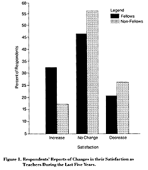
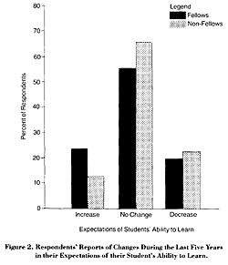
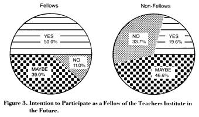

<main>

<small><a href="..\..\">Main Page</a> : <a href="..\">Periodical Publications and Books</a> : Teaching in America: The Common Ground</small>

<small>[ <a href=".\">Back to the Table of Contents</a> ]</small>

<h2 align="CENTER">Summary of Principal Findings: 
Report on Questionnaires Administered 
in 1982 to New Haven Teachers</h2>
<h4>Contents:</h4>
<ul>
<a href="#sect_1"><li>Background</li></a>
<a href="#sect_2"><li>Demographic Information</li></a>
<a href="#sect_3"><li>Teacher Morale</li></a>
<a href="#sect_4"><li>Student Performance</li></a>
<a href="#sect_5"><li>Use of Institute Curriculum Units</li></a>
<a href="#sect_6"><li>Recurring Participation</li></a>
</ul>

<small>This summary was adapted with the assistance of James B. Saakvitne from reports prepared by Mitchell Katz</small>

<a name="sect_1">
<h4>Background</h4>

In 1982 the Yale-New Haven Teachers Institute undertook a 
comprehensive examination of its program. We solicited detailed opinions of 
the Institute, as well as background information, from all New Haven 
teachers--Fellows and non-Fellows, those who have used Institute curriculum 
units and those who have not. We wanted especially to examine the 
Institute's impact on teachers' learning and morale, as well as students' 
learning, and to investigate whether unit use depends on the user having 
been a Fellow.

We developed two questionnaires for the purposes of the study: 
one for teachers who have not been Institute Fellows, but may have used 
Institute units, and one for Fellows. The inclusion of non-Fellows provided 
a valuable control group; also, we hoped to learn more about teachers who 
have not yet participated in the Institute so that we could better serve 
them.

The response rate was high. Fifty-seven percent of non-Fellows (183 
teachers) and 75% of Fellows (83 teachers) completed questionnaires, 
yielding a total sample of 266 teachers. No discernible bias was found in 
the response rate; the sample is representative of both Fellows and 
non-Fellows.

After analyzing the data, we prepared three reports: one on teachers in 
the humanities, a second on teachers in the sciences, and a third on the 
combined samples. The information presented here is drawn from the 
responses of teachers in both the humanities and the sciences.

</a>
<a name="sect_1">[ </a><a href="#top">to the top of the chapter</a> ]

<a name="sect_2">
<h4>Demographic Information</h4>

Fellows and non-Fellows do not look significantly different on 
basic demographic variables: sex, age, years teaching in New Haven, years 
in teaching profession, grades taught, subjects taught, education level, or 
graduate-school major. This similarity indicates that the Institute has 
recruited a representative group of New Haven teachers, consistent with its 
aim of working with all New Haven teachers without regard to previous 
academic background or other factors.

During the past four years, 50.5% of New Haven teachers have taught 
subjects in which they did not major in college or graduate-school (41.2% 
in the humanities, and 63.7% in the sciences). This finding points up the 
importance of the additional academic preparation the Institute provides. 
Almost half of the Fellows report that their participated in the Institute 
increased their knowledge of their discipline "a lot." About half of the 
Fellows (46.7%) view their participation in the Institute as more relevant 
to their teaching, more important to their professional growth (55.4%), and 
more rigorous than their teacher preparation classes.

The study documented that the Institute assists teachers with writing. 
Seventy-five percent report that the process of writing a unit improved 
their own writing. Sixty-two percent of the Fellows report that the process 
of writing a unit improved their teaching of writing in school courses.

</a>
<a name="sect_2">[ </a><a href="#top">to the top of the chapter</a> ]

<a name="sect_3">
<h4>Teacher Morale</h4>

The issue of teacher morale has received extensive attention in 
both popular and scholarly literature, and the Institute has been 
especially concerned with the revitalization of teachers. Over one-quarter 
of the teachers report an increase in the stress they experienced on their 
job during the last five years. Yet, Institute Fellows are about twice as 
likely as non-Fellows to report an increase in their satisfaction as 
teachers during the same period (32.5% versus 17.4%, see Figure 1). The 
process of actually teaching Institute units may be similarly rewarding. 
Over half of the Fellows report that Institute units are more enjoyable to 
teach than curricula they have prepared in other programs or on their own. 
Also, over half of the Fellows and almost half of the non-Fellows report 
that Institute units by other teachers are more enjoyable to teach than 
commercially prepared curriculum materials. Almost half of the Fellows 
indicate that the opportunity to participate in the Institute has 
influenced their decision to continue teaching in the New Haven Public 
Schools (47.5%).

The relationship between teacher expectations and student 
performance is well-established. The study showed that Fellows are nearly 
twice as likely as non-Fellows to report an increase during the last five 
years in their expectations of their students (23.9% versus 13.1%; see 
Figure 2).

</a>
<a name="sect_3">[ </a><a href="#top">to the top of the chapter</a> ]

<a name="sect_4">
<h4>Student Performance</h4>

We asked teachers to rate student response to Institute units. 
By having teachers compare student response to Institute units with student 
response to other curricula they have prepared, we were able to control for 
a teacher's tendency to report lower or higher student response than is in 
fact the case. We investigated student attention, interest, motivation, and 
mastery. The results generally substantiate the positive impact the 
Institute has had on student performance. Nearly half of the Fellows report 
that their Institute units resulted in higher student attention, interest, 
motivation, and mastery than have other curricula they have prepared. Both 
Fellows and non-Fellows also report similar success with Institute units by 
other teachers, as compared with commercially-prepared curricula they have 
used. For each student behavior examined many teachers report higher 
student response, and no teacher compares the units unfavorably with 
commercial materials. Because Fellows and non-Fellows report similar levels 
of success with Institute units by other teachers, the usefulness of 
Institute units does not appear to depend on a teacher having been an 
Institute Fellow.

Over 50% of the Fellows report that their units have been 
successful with the least advanced students. Sixty percent report them to 
be successful with advanced students, and 70% report them to be successful 
with average students. Consistent with a central aim of the Institute, the 
units teachers write appear to serve all students, not just those already 
successful in school.

</a>
<a name="sect_4">[ </a><a href="#top">to the top of the chapter</a> ]

<a name="sect_5">
<h4>Use of Institute Curriculum Units</h4>

On the average, Fellows have used a total of 3.0 units and 
non-Fellows 0.9 units. Because the program in the humanities has existed 
for a longer time and has produced many more units than the science 
program, Fellows and non-Fellows in the humanities generally report using 
more units. Over 60% of all Fellows have used another author's unit, and 
40% of the non-Fellows have used at least one unit. Nearly two-thirds of 
the Fellows report that the Institute has had a large impact on their 
teaching curriculum. Over 75% of the Fellows agree that the Institute's 
interdisciplinary approach has broadened their teaching curriculum, and 
that the Institute has contributed in a positive fashion to the curriculum 
of the New Haven schools.

Over 90% of the Fellows report that their own units are adaptable 
to grade levels other than the intended one(s). Similarly, over 85% of the 
Fellows and non-Fellows report that Institute units by other teachers are 
adaptable to other grade levels.

The questionnaire also investigated what prompted teachers to use 
institute units and whom they sought out for help in using the units. About 
half of the Fellow's and one-third of the non-Fellows were prompted to use 
units by their authors, and a similar percentage asked the authors for help 
with the units. These results demonstrate the important role of the author 
in promoting unit use. System-wide in-service workshops are also important 
in prompting unit use. Eighty percent of the Fellows and 40% of the 
non-Fellows have attended at least one workshop where Institute units were 
presented. Over 80% of Fellows and one-half of non-Fellows report that they 
have incorporated material from these workshops in their own teaching.

</a>
<a name="sect_5">[ </a><a href="#top">to the top of the chapter</a> ]

<a name="sect_6">
<h4>Recurring Participation</h4>

The Institute seeks to involve teachers on a recurring basis. 
The questionnaire results document the value of a teacher participating 
more than once. The more times Fellows had participated the more likely 
they were to report a large increase in their knowledge of their subject, 
more enjoyment teaching units by other Fellows, higher student motivation 
for their own units, and higher student attention, motivation, and mastery 
of other teachers' units. They were more likely to say that writing a unit 
improved their teaching of writing, and more likely to agree strongly that 
the Institute has had a large impact on their teaching curriculum, and has 
broadened it. Two-thirds of non-Fellows will consider participating in the 
Institute in the future. Only 11% of Fellows do not intend to participate 
again (see Figure 3).

</a>
<a name="sect_6">[ </a><a href="#top">to the top of the chapter</a> ]

<small>[ <a href=".\">Back to the Table of Contents</a> ]</small>

<small><a href="..\..\">Main Page</a> : <a href="..\">Periodical Publications and Books</a> : Teaching in America: The Common Ground</small>

</main>